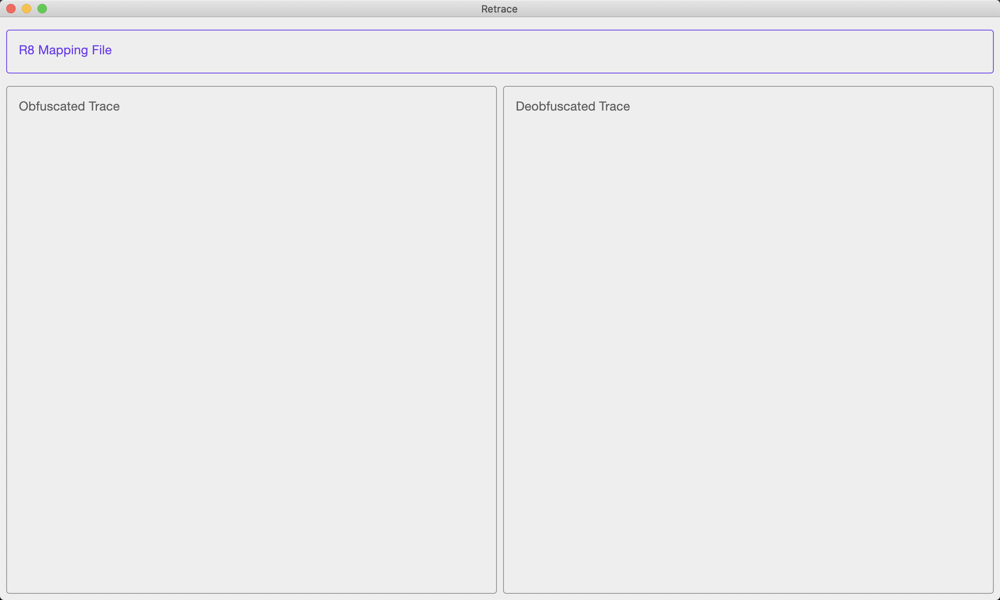

# Retrace

R8 Retrace, only for MAC

### Running desktop application
```
./gradlew :desktop:run
```

### Building native desktop distribution
```
./gradlew :desktop:package
# outputs are written to desktop/build/compose/binaries
```

